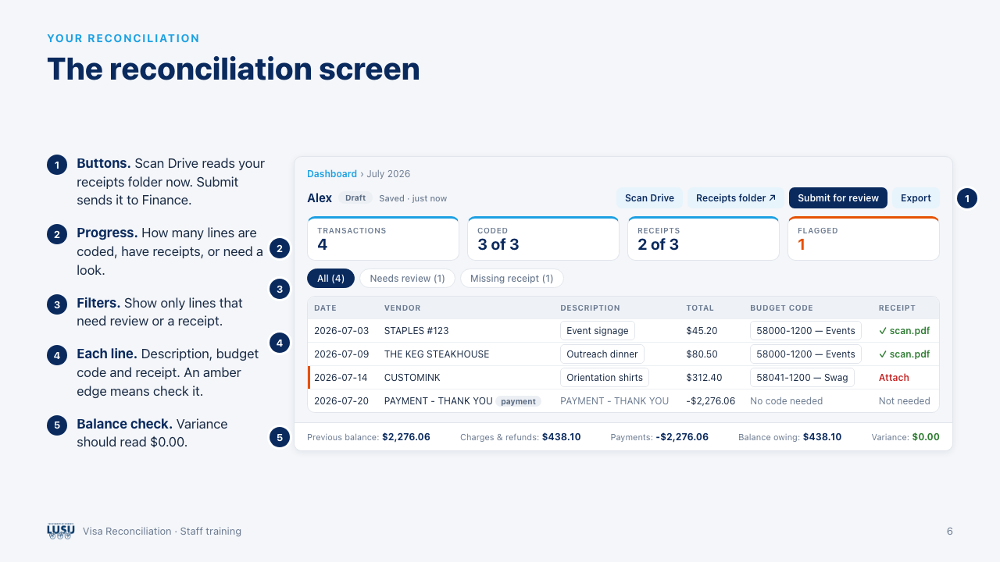
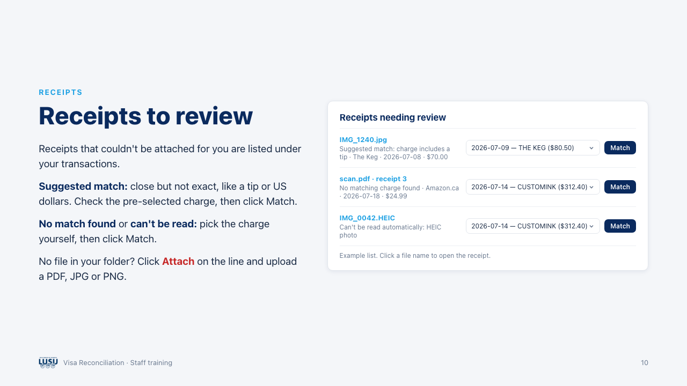
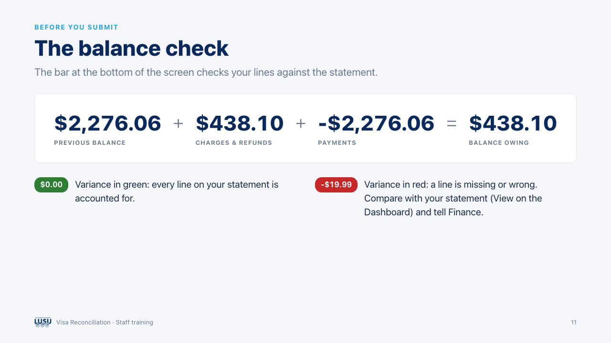
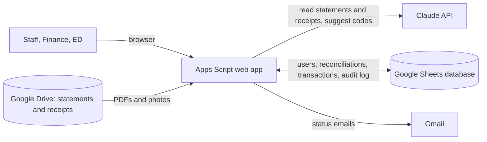
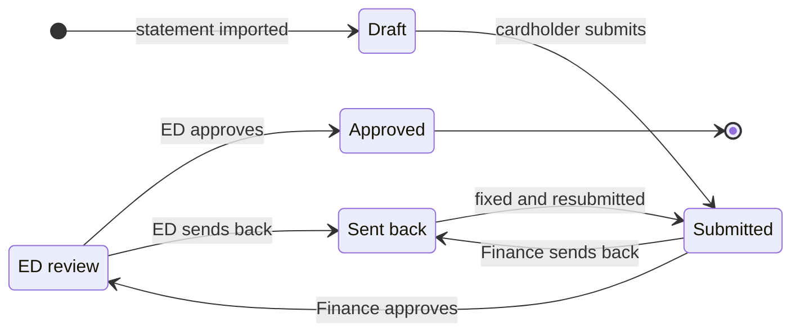

# LUSU Visa Reconciliation

**A web app that turns a student union's monthly Visa card reconciliation from a spreadsheet chore into a guided workflow.** Statements are read by AI, receipts match themselves to charges, and every reconciliation must balance to the statement before it moves through Finance and Executive Director approval.




## The problem

At Lakehead University Student Union (LUSU), staff, executives and centre coordinators each carry a Visa card. Every month each cardholder filled in a reconciliation spreadsheet: every charge, its HST, one of nearly 400 budget codes, a receipt for each purchase, then signatures from Finance and the Executive Director. It was slow, easy to get wrong, and hard to track.

## What it does

- **Statement in, lines out.** When Finance saves a cardholder's statement to Drive, that person gets an email. One click imports every line: purchases, fees, refunds and payments, minus signs included.
- **Budget codes suggested.** Each charge gets a suggested code from the cardholder's own department, weighted by how the same vendor was coded before. Guesses are flagged for a second look.
- **Receipts attach themselves.** Cardholders drop photos or scans into their receipts folder with any file name. Each receipt is read, even several in one scan, and matched to its charge. Exact matches attach automatically; close ones, like a tip or a US-dollar receipt, wait for a one-click review.
- **It has to balance.** Previous balance plus every line must equal the balance owing on the statement. The variance should read $0.00 before anyone submits.
- **Approvals with a paper trail.** Cardholder submits, Finance reviews and can correct codes, the Executive Director gives final approval, and either can send it back with notes. Everyone is emailed at each step, every change is logged, and approved reconciliations are filed in Drive in LUSU's standard spreadsheet format.
- **Reports and year-end.** Spending by department and budget code with CSV export, plus a fiscal year close that archives the year's data and files.

| Receipts that need a second look | The balance check |
| --- | --- |
|  |  |

<sub>Screens use example data. They come from the staff training deck in [docs/staff-training](docs/staff-training).</sub>

## How it works



Every reconciliation moves through the same states:



## Engineering highlights

- **AI with guardrails.** Claude reads statements and receipts, but code makes the calls: the printed minus sign overrides the model's label, a "PAYMENT" line is always a payment, and a receipt attaches only when Claude is confident *and* the amounts agree to the cent. Everything else goes to a person.
- **Reconciliations prove themselves.** The statement's summary figures are extracted alongside its lines, so a missed or misread line shows up as a variance before Finance ever sees it.
- **Each receipt is paid for once.** Scanned details are stored after the first read. Waiting receipts are re-matched from that text only when the cardholder's open charges change, tracked with a fingerprint of charge IDs, so the hourly scan costs nothing when nothing is new.
- **Built for people working at the same time.** Slow AI calls run outside the script lock and only sheet writes are serialized, so one person's import never blocks another's approval. A per-user guard stops two scans from reading the same files.
- **Google Sheets as a database, carefully.** Rows are read and written by column name, new columns are added without moving existing ones, and the year-end close writes rows to an archive spreadsheet before removing them from the live sheets.
- **One deployment, many roles.** The app runs under its owner's account to reach the database, identifies each visitor by their Google account, and gives each cardholder a personal receipts folder that is created and shared automatically.

## Tech stack

| Layer | Tools |
| --- | --- |
| Backend | Google Apps Script (V8 JavaScript) |
| Database | Google Sheets |
| Files | Google Drive (Shared Drive) through the Drive API v3 |
| AI | Claude API: Claude Haiku 4.5 reads statements and receipts, Claude Sonnet 4.6 suggests budget codes |
| Frontend | Apps Script HTML Service with plain JavaScript and CSS |
| Tooling | [clasp](https://github.com/google/clasp) for local development and deployment |

## Project structure

```
src/
  Transactions.gs    Statement import, AI coding, new-statement emails, dashboard
  Receipts.gs        Receipt reading and matching, attach and remove, duplicates, reminders
  Approval.gs        Submit, Finance and ED approval, notifications
  Auth.gs            Sign-in, roles, user management
  Folders.gs         Shared Drive folders and access
  Export.gs          Export in LUSU's spreadsheet format
  Reports.gs         Monthly, year-to-date and per-person reports
  FiscalYear.gs      Fiscal year-end close and archiving
  Database.gs        Sheet schema, budget codes, migrations
  Page.html, ClientScript.html, Stylesheet.html    The web interface
docs/
  SETUP.md           Deploying your own copy
  SPRINT_PLAN.md     The original three-sprint build plan
  staff-training/    Training slides and a slideshow for staff
```

## Running your own copy

You need a Google Workspace account, a Shared Drive you manage, an [Anthropic API key](https://console.anthropic.com/), and Node.js.

```bash
npm install -g @google/clasp
clasp login
cp .clasp.json.example .clasp.json   # add your Apps Script project's script ID
clasp push
```

Then set the Script Properties, initialise the database and deploy the web app. [docs/SETUP.md](docs/SETUP.md) walks through each step.

## Status

In pilot at LUSU in 2026, running alongside the existing manual process.

## About

Built by [@fikokwu](https://github.com/fikokwu) for Lakehead University Student Union, developed alongside Claude Code.
